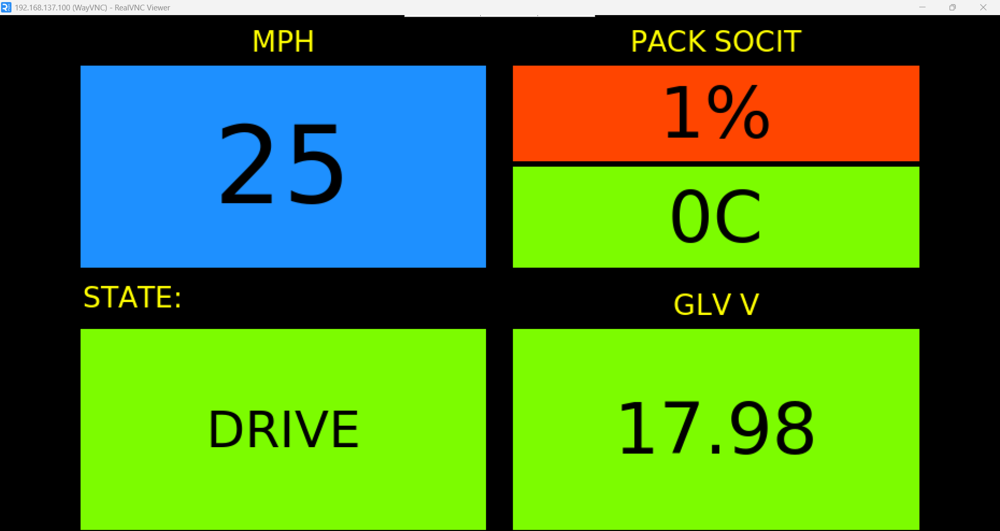

# Raspberry Pi Telemetry Host

## Hardware
| Component | Description |
|------------|-------------|
| Raspberry Pi 4 Model B | Running Debian 12 (Bookworm) with Python 3.11 |
| [Waveshare 2-CH CAN HAT](https://www.waveshare.com/wiki/2-CH_CAN_HAT) | Dual MCP2515 SPI CAN interface for vehicle data |
| [4" IPS Touchscreen LCD Display (800×480)](https://www.amazon.com/dp/B07XBVF1C9) | HDMI touchscreen display for dashboard |
| [Mobile Router Industrial](https://store.ui.com/us/en/category/internet-solutions/collections/unifi-mobile-routing/products/umr-industrial-us) | WiFi router designed for indoor/outdoor IoT applications |

## Dashboard Example

